# SO101 servo system identification

Generated by `python -m halloween_bot.sim.sysid fit`. Traces: `so101_bimanual_test_dataset/ep0` (777 ticks @ 30 Hz).

## Method

- **Replay** (props-free model): start at the first measured frame; each tick clamp the command to sim present ± 20 (lerobot `max_relative_target`), bound it to the key's range, write ctrl, step physics for one control period. Sim time is locked to the control clock (7/7/6 steps of 5 ms per 30 Hz tick), like the wall-clock-paced engine. Open loop: the sim is never reset to the real state.
- **Target**: `action[t]` is answered by `observation.state[t+1]`. Gripper ticks where the real jaw stays > 3 units above its command while still (an object in the jaws) are masked.
- **Fit**: log of kp, kv, damping, frictionloss, armature, forcerange per motor, shared by both arms, one joint `scipy.optimize.least_squares` (2-point Jacobian, `x_scale='jac'`, bounds 1e-4..2e3). Residuals are sim − real over the first 80% of each trace, per key divided by that key's std (floor 2 units). Only keys whose command spans ≥ 5 units enter the residual; a motor with no such key keeps its Menagerie values.
- **Multi-start**: the cost is rugged (friction, force saturation), so the finite-difference step decides where the optimizer stalls. One fit per step runs in parallel; the lowest *training* cost is continued with a coarser step. Holdout data never influences any choice.
- **Holdout**: the last 20% of each trace, scored on the same open-loop replay.

## Holdout RMSE per key (normalized units)

| key | commanded range | Menagerie | fitted | change |
|---|---:|---:|---:|---:|
| `left_shoulder_pan.pos` | 21.1 | 0.50 | 0.32 | -35% |
| `left_shoulder_lift.pos` | 33.2 | 0.62 | 0.02 | -96% |
| `left_elbow_flex.pos` | 42.5 | 0.48 | 0.98 | +103% |
| `left_wrist_flex.pos` | 38.1 | 0.10 | 0.12 | +24% |
| `left_wrist_roll.pos` | 1.5 (not excited) | 0.36 | 0.36 | -1% |
| `left_gripper.pos` | 0.5 (not excited) | 0.11 | 0.11 | -4% |
| `right_shoulder_pan.pos` | 78.7 | 2.27 | 0.40 | -82% |
| `right_shoulder_lift.pos` | 113.3 | 3.81 | 2.53 | -33% |
| `right_elbow_flex.pos` | 141.2 | 3.05 | 0.52 | -83% |
| `right_wrist_flex.pos` | 57.8 | 2.31 | 0.42 | -82% |
| `right_wrist_roll.pos` | 17.6 | 0.53 | 0.10 | -82% |
| `right_gripper.pos` | 56.5 | 5.88 | 0.94 | -84% |
| **mean, body joints** | | **1.40** | **0.58** | **-59%** |
| **mean, all keys** | | **1.67** | **0.57** | **-66%** |

Training-window RMSE, mean over all keys: Menagerie 2.46, fitted 0.59.

## Fitted parameters (shared by both arms)

Training cost (½Σr²): Menagerie 154.8 → fitted 8.16. Starts: step 0.001 → 10.80 (51 evals), step 0.003 → 8.20 (38 evals), step 0.01 → 8.74 (42 evals); best continued with step 0.01 (17 evals). Wall time 62.9 s. Jacobian condition number at the optimum 9.5e+02. Residual keys: left_shoulder_pan, left_shoulder_lift, left_elbow_flex, left_wrist_flex, right_shoulder_pan, right_shoulder_lift, right_elbow_flex, right_wrist_flex, right_wrist_roll, right_gripper.

| motor | kp | kv | damping | frictionloss | armature | forcerange |
|---|---:|---:|---:|---:|---:|---:|
| shoulder_pan | **70.53** | **7.239** | **0.2415** | **0.5507** | **0.2933** | **4.862** |
| shoulder_lift | **26.38** | **2.112** | **0.1494** | **0.7841** | **0.08799** | **2.967** |
| elbow_flex | **15.01** | **1.095** | **0.1236** | **0.3925** | **0.02387** | **1.065** |
| wrist_flex | **74.81** | **7.623** | **0.1563** | **0.4937** | **0.189** | **3.884** |
| wrist_roll | **28.72** | **1.595** | **1.068** | **0.2205** | **0.0934** | **1.355** |
| gripper | **148.7** | **17.53** | **0.8307** | **0.1303** | **0.3134** | **5.974** |

Bold = fitted; plain = Menagerie `sts3215` default (kp 998.22, kv 2.731, damping 0.60, frictionloss 0.052, armature 0.028, forcerange 2.94).

## Hold offsets by approach direction (present − command, units)

Ticks where the command has been still for 0.5 s, split by whether it last arrived from above or below. Real servos stop short of the target (friction) and sag under gravity; known real behavior: the elbow reads ~+5 above command extended horizontally, shoulder_lift sags 1–2. Menagerie's stiff servo holds ~0 either way.

| key | from | n | real | Menagerie | fitted |
|---|---|---:|---:|---:|---:|
| `left_shoulder_pan.pos` | above | 464 | +0.32 | +0.00 | +0.09 |
| `left_shoulder_pan.pos` | below | 89 | -0.08 | +0.00 | +0.05 |
| `left_shoulder_lift.pos` | below | 726 | +0.36 | +0.02 | +0.56 |
| `left_elbow_flex.pos` | above | 165 | +2.70 | +0.02 | +1.92 |
| `left_elbow_flex.pos` | below | 452 | +0.49 | +0.02 | +1.26 |
| `left_wrist_flex.pos` | below | 676 | -0.12 | +0.00 | +0.02 |
| `right_shoulder_pan.pos` | below | 27 | -0.17 | +0.21 | -0.35 |
| `right_shoulder_lift.pos` | above | 122 | +3.65 | +0.01 | +1.54 |
| `right_shoulder_lift.pos` | below | 154 | +0.95 | -0.21 | +0.41 |
| `right_elbow_flex.pos` | above | 41 | +2.29 | +0.00 | +2.24 |
| `right_elbow_flex.pos` | below | 30 | +0.19 | +0.03 | +0.40 |
| `right_wrist_flex.pos` | above | 30 | +0.67 | -0.00 | +0.29 |
| `right_wrist_flex.pos` | below | 35 | -0.21 | +0.01 | -0.05 |
| `right_wrist_roll.pos` | above | 10 | +0.29 | +0.00 | +0.21 |
| `right_wrist_roll.pos` | below | 212 | -0.12 | +0.00 | -0.07 |

## Overlays

Grey band = holdout. Thick black = real, blue = fitted sim, orange = Menagerie sim, dashed grey = command.

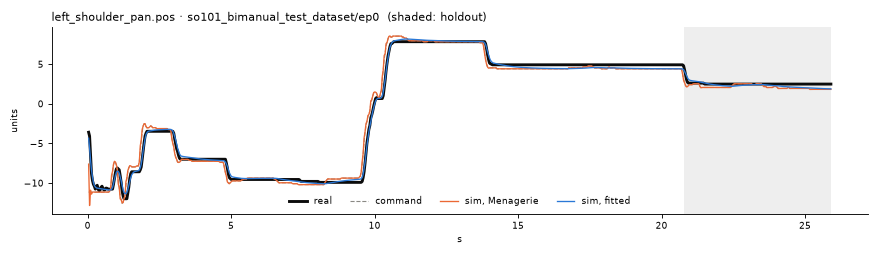
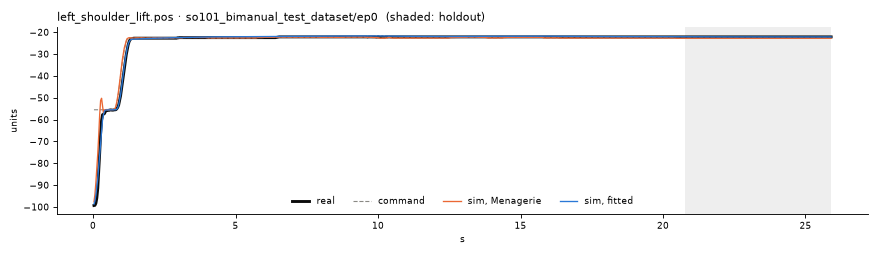
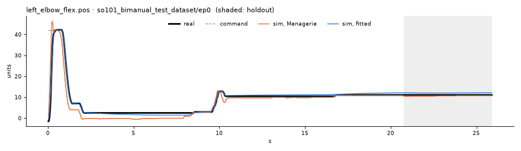
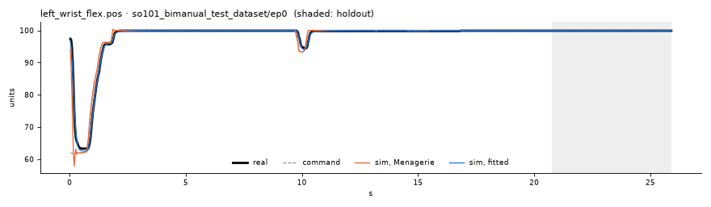
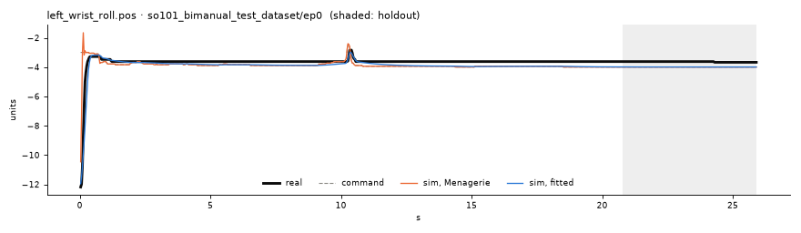
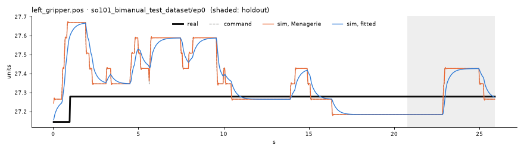
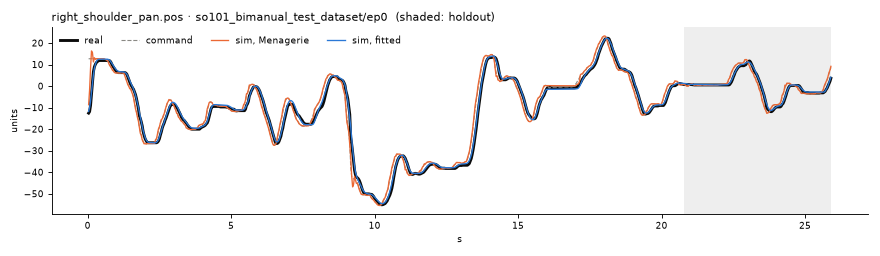
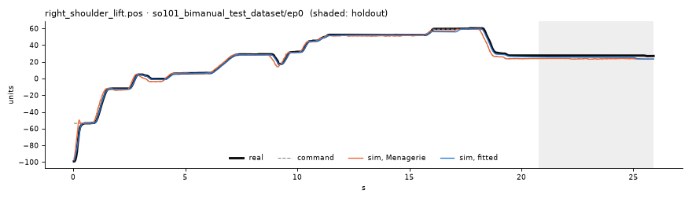
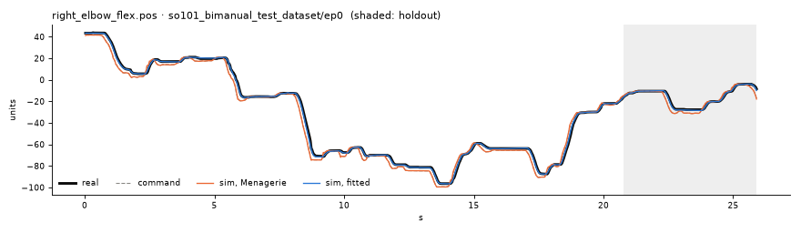
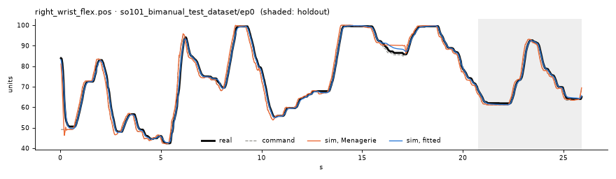
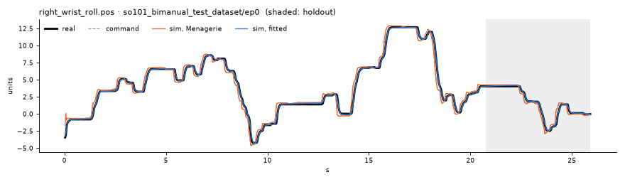
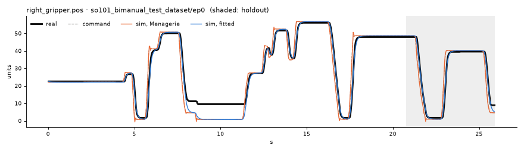

## Notes (hand-written 2026-09-26; rerunning the CLI regenerates everything above and drops this section)

- **Excitation.** Every motor is excited on the right arm (commanded ranges 17.6 to 141 units). The left arm
  moves pan, lift, elbow and wrist_flex (21 to 43) but not wrist_roll (1.5) or the gripper (0.5), so those two keys
  stay out of the residual. No motor had to be left at Menagerie defaults. The weakest fitted key is
  right_wrist_roll (range 17.6, std 3.9).
- **Deviations from the plan.**
  1. `forcerange` is fitted as well (36 parameters, as the spec lists). With the same settings, the plan's five
     fields reach training cost 35.3 and body holdout 0.75. Adding forcerange gives 10.8 / 0.74, and the right
     gripper holdout drops 5.8 → 0.8.
  2. Sim time is locked to the 30 Hz clock (7/7/6 steps). A fixed `round(1/(hz·dt))` = 7 steps would run each
     tick 5% long.
  3. The CLI uses a multi-start over the finite-difference step, selected on training cost.
  4. The gripper contact mask.
- **The parameters are effective, not physical.** Starts with near-equal cost land far apart
  (e.g. shoulder_lift kp 26 vs 340). The consistent part: every motor has kp far below 998 and 3 to 15× more
  frictionloss. The real servos (firmware P=16, D=32) are soft near the setpoint and sticky, so they stop short
  and sag. Menagerie's servo tracks almost perfectly. The gripper's forcerange (5.97) exceeds the STS3215 stall
  torque, and its armature/kv compensate. On hardware, lerobot caps the gripper at 50% torque.
- **Largest remaining error: right_shoulder_lift holdout (2.53).** The holdout starts right after the episode's
  only large downward lift move. After it, the real arm holds +3.65 above command, vs +0.95 when it approaches
  from below (friction and gravity sag add up). Few training holds come from above, so the fitted sim
  reproduces only +1.54. The ±10/±20 steps in `sysid_collect.py` approach from both sides and should pin this
  down.
- **left_elbow_flex is worse (0.48 → 0.98).** That joint is still for the whole holdout, and the fitted sim
  holds about 1 unit above the real one.
- **Engine test.** With this params.json, `tests/test_engine.py::test_move_reaches_target_headless` fails.
  right_elbow_flex ends at 75.95 for a target of 70 (tolerance ±4, off by 5.95). That move approaches the elbow
  from above (95 → 70). On from-above holds in this episode the real elbow sits +2.29 above command (up to
  +9.9 at extended poses), and the fitted sim +2.24. The offset is real behavior; the ±4 tolerance was written
  for Menagerie's stiff servo. The test was not changed.
